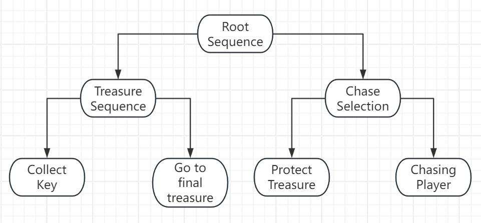
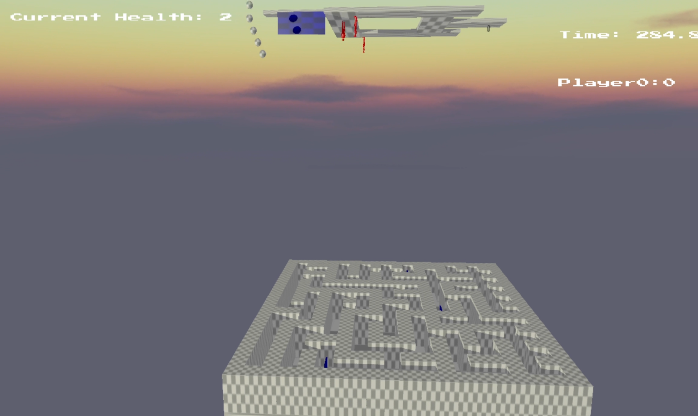
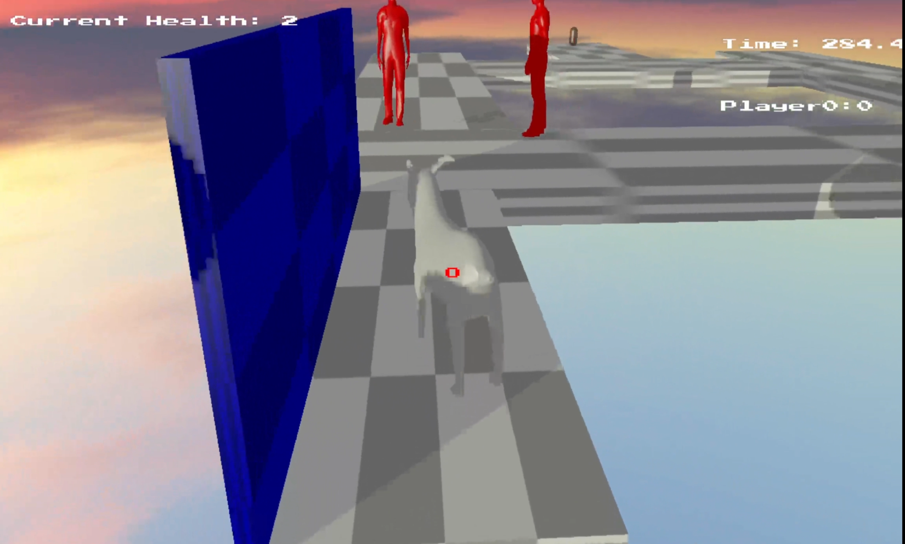
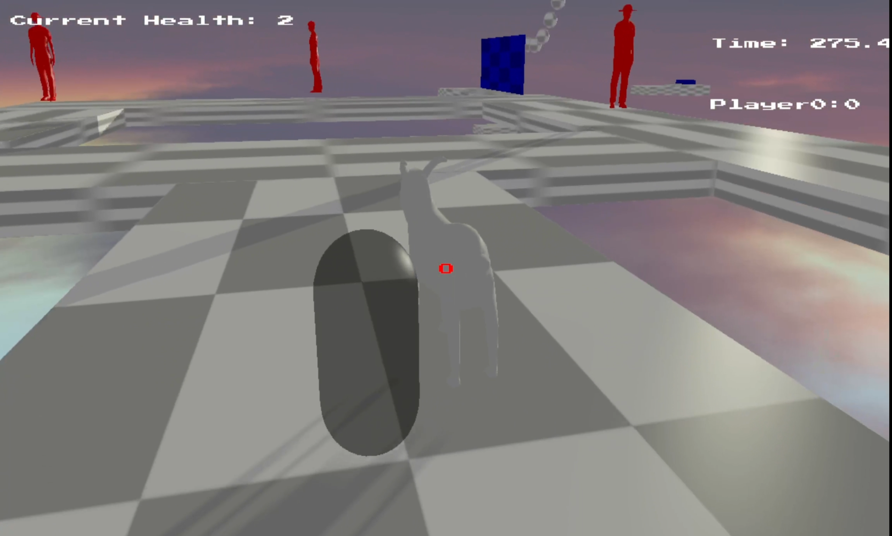
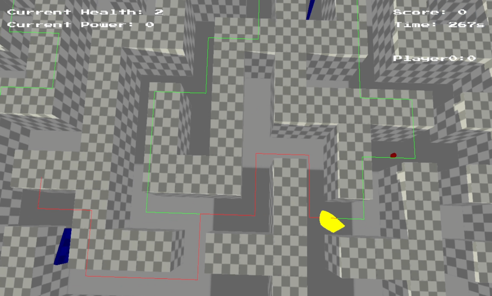
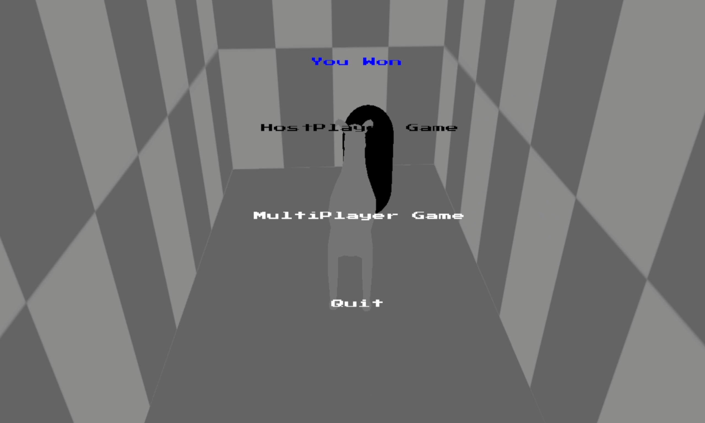
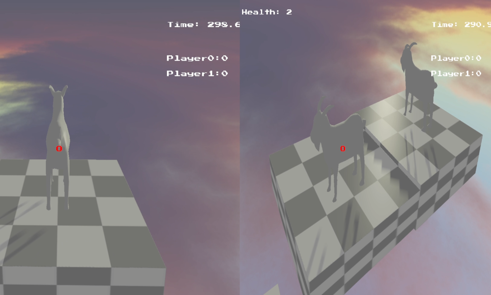

# GameTechnologies
# CSC8503

Developing a C++-based game encompassing physics, networking, and artificial intelligence functionalities within a rudimentary 3D setting. The player assumes control of an avatar through intricate physics computations, integrating collision detection and resolution mechanisms. 

# Youtube Link:

Most of the functionality is demonstrated in the following demo [video](https://youtu.be/B7SkwaWGWYE)

# Gameplay

Players must complete level challenges within a set time to win the game. Exceeding the time limit results in game over, and the player receives a final score. Multiplayer options are available in the menu, players compete by collecting points through gathering items, allowing players to pause or exit. The current score is displayed on-screen during gameplay. The game world consists of two mirrored levels, with gravity completely inverted between them.
## Level 1:

Players navigate through obstacles such as drawbridges and swinging hammers. Simple enemies patrol near the key; approaching triggers pursuit, contact results in player death and respawn. The objective is to covertly obtain the key, causing a portal to appear at the spawn point. Progressing to the next level is achieved by passing through the portal.
## Level 2:

The level is a randomly generated maze with an intelligent adversary—an angry goose. The goose roams the maze, competes with the player to collect items, pursues the player upon encounter, and also gives chase when the player acquires the guarded treasure. Players accumulate points by collecting items while aiming to successfully steal the treasure guarded by the formidable goose to achieve victory.

# List of Features
## Core:

- Player move by Linear Impulse and rotate by torque.
- Follow the player's spring camera.
- Basic collisions between objects (AABB, Sphere, plane).
- Launch hook by Raycast.
- Simple state machine patrols enemies can chasing player.
- Using impulse to resolve collision with coefficients of restitution.
- Separate collision objects out using projection.
- AABB, OBB and constraint obstacle in the world.
- Using collision to collect rewards 
- According to timing and player completion to determine game win or loss.

## Advanced:

- Intelligent enemies using behavior trees compete with players.
- 
- AI uses raycasting and scans by sector to avoid obstacles.
- When the player initiates a skill attack, the AI will experience death and respawn.
- Grid-based pathfinding and displaying the lines.
- The player uses pathfinding to navigate for treasure.
- AI can follow the pathfinding to collect bonuses and chase players.
- OBB Rotation boards are by orientation/Aixs constraint and the hammer by position constraint.
- Adding friction coefficient when objects moving on the ground.
- Advanced Collision Detection (Capsule, OBB etc).
- Spatial Acceleration Structures are used by Broad Phase and Narrow Phase.
- Multiplayer Games and Online Score Tables.
- Stack Automata used for Menu.
# Hotkey

"WASD" - Player Move.
"QE" - Player Rotate.
"SPACE" - Player Jump (can double jump).
"LEFT SHIFT" - Player Accelerate.
"T" - Player launches grappling hooks.
"F" - When empowered,  player can dash towards enemy and hit it.
"Y" - Switch camera perspective.
"B" - Change Broad phase and Narrow phase.
"P" - Put down the carried objects.

#  Screenshot

You can see the GameWorld below:

You can see the Level 1 below:

You can see the Level 2 below:

You can see the online play below:

